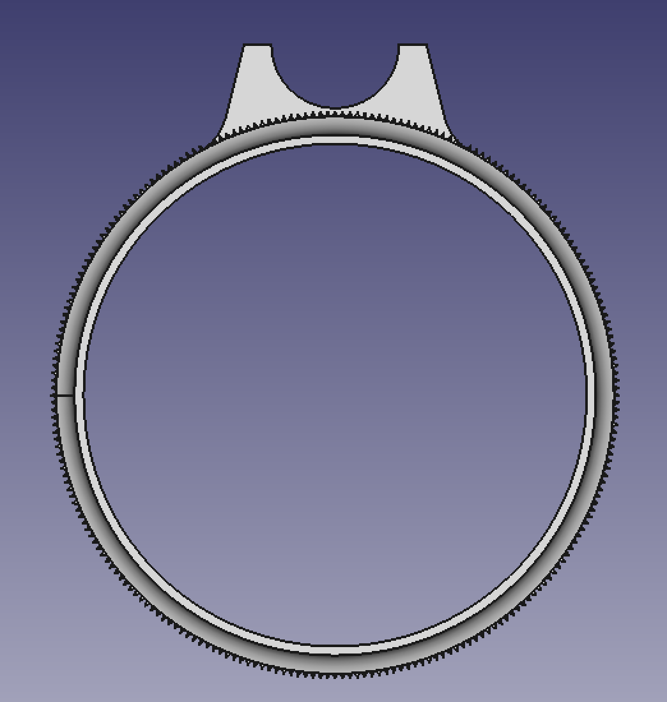

<!--
---
lang: american
---
-->

# Focus ring sleeve for Fuji X100

This is a focus ring sleeve for
[Fuji X100](http://fujifilm-x.com/x100system/en/) camera similar to
[Schnickerbocker](http://www.shapeways.com/shops/schnickerbocker)'s. It is
compatible with all Fuji X100 cameras (X100, X100S and X100T).

This model allows easy grip of the ring when using the camera manual
focus. The tab also helps you to fine focus very quickly.

I ordered one model from [Shapeways](http://www.shapeways.com/) and since
the sleeve didn't fit (the ring was to large for the camera ring) and the tab
was missing (Shapeways shows picture from both tabbed and untabbed version
on the same page, what a shame), I decided to modelize the focus ring myself
and to put it under a [WTFPL](http://www.wtfpl.net) license. Enjoy!

## Views

See the [x100-focus-ring.stl](x100-focus-ring.stl) file a render.

## Copyright

Author: Sébastien Gross `<seb•ɑƬ•chezwam•ɖɵʈ•org>` [@renard_0](https://twitter.com/renard_0)

License: WTFPL, grab your copy here: http://www.wtfpl.net

